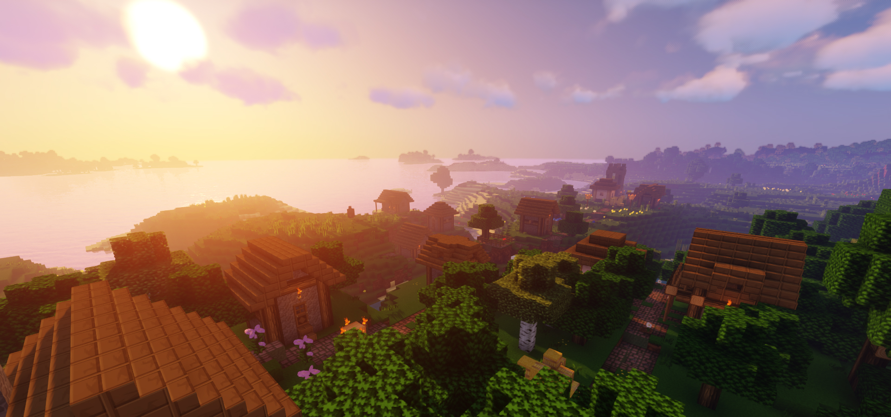

# **Neon-Spigot**
      

## **What is Neon?**
Neon is a Spigot plugin where provides a variety of features to manage the Spigot Minecraft Server. It also provides some tweaks to simplify the game mechanics within the vanilla Minecraft.

## **Installation**
1. Download the latest of Neon jar file from [here](https://github.com/ICitiesMaxQ/Neon-Spigot/releases/latest "Latest Neon")!
2. Once downloaded, move the file to the "plugins" folder in the server folder.  
   E.g.: `/usr/{YOUR_SERVER_FOLDER}/plugins/`
3. Start the server if you haven't already, or reload the server if you have started the server.
4. There you go!

## **Note:**
This plugin may or may not compatible with other plugins.
